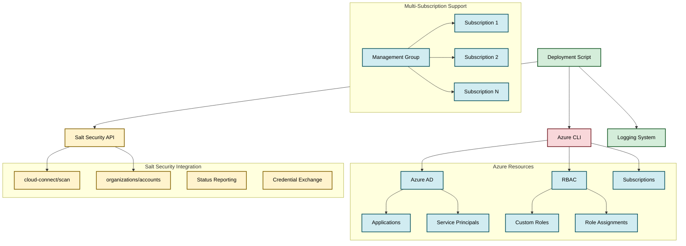

# System Architecture

## Overview
Shell script-based multi-cloud deployment automation system focused on Salt Security integration. Architecture emphasizes simplicity, reliability, and comprehensive logging for Azure resource provisioning.

## Architecture Diagram



## Component Architecture

### Deployment Scripts
**Location**: `azure/subscription/deployment/`, `azure/management-group/deployment/`
- **subscription-level-deployment.sh**: Single subscription Azure resource creation
- **management-group-level-deployment.sh**: Multi-subscription parallel deployment
- **parallel-subscription-level-deployment.sh**: Worker script for parallel execution

**Key Features**:
- Unique nonce generation for resource isolation
- Comprehensive parameter validation
- Structured logging with timestamps
- Error handling with status reporting
- Azure CLI integration patterns

### Deletion Scripts  
**Location**: `azure/subscription/deletion/`, `azure/management-group/deletion/`
- **subscription-level-deletion.sh**: Single subscription cleanup
- **management-group-deletion.sh**: Multi-subscription resource removal

### Azure Resource Creation Pattern
1. **Application Creation**: Azure AD application with unique naming
2. **Client Secret Generation**: 2-year validity period
3. **Service Principal Creation**: Automated identity management
4. **Custom Role Definition**: Read-only permissions for ApiManagement, Kubernetes, ResourceGroups
5. **Role Assignment**: Service principal to custom role binding
6. **Credential Exchange**: Secure transmission to Salt Security

### Salt Security Integration Architecture
**API Endpoints**:
- `POST /v1/cloud-connect/scan/azure` - Deployment status and credentials
- `DELETE /v1/cloud-connect/organizations/accounts/azure/{subscription-id}` - Account cleanup

**Authentication**: Bearer token-based API authentication

**Data Flow**:
```
Deployment Script → Azure Resources → Salt Security API → Status Update
                                   ↓
                            Credential Storage (Salt Platform)
```

### Error Handling Strategy
- **Azure Operation Failures**: Retry logic with exponential backoff
- **Salt API Failures**: Continue deployment, log warnings
- **Resource Conflicts**: Unique nonce prevents naming collisions
- **Permission Issues**: Clear error messages with remediation steps

### Logging Architecture
**Log File Naming**: `{operation}-{nonce}-{timestamp}.log`
- **Structured Format**: Timestamp, level, message
- **Log Levels**: INFO, WARNING, ERROR  
- **Console Output**: Color-coded status messages
- **File Output**: Complete operation history

### Multi-Subscription Architecture
**Management Group Deployment**:
```
Management Group ID → Subscription List → Parallel Worker Scripts
                                        ↓
                                  Individual Status Reports
```

**Parallel Processing**:
- GNU `parallel` utility for concurrent execution
- Individual log files per subscription
- Aggregated status reporting
- Error isolation between subscriptions

### Security Architecture
**Principle of Least Privilege**:
- Read-only Azure permissions
- Subscription-scoped access
- Time-limited client secrets
- Secure API communication

**Resource Isolation**:
- Unique nonce-based naming
- Tagged resources for identification
- Separate service principals per deployment

## Scalability Considerations
- **Parallel Execution**: Management group deployments support concurrent subscription processing
- **Resource Limits**: Azure AD application limits (no specific handling)
- **API Rate Limits**: No Salt Security API throttling implemented
- **Log Management**: Local file storage (no rotation implemented)

## Deployment Strategies
**Single Subscription**: Direct script execution with immediate feedback
**Management Group**: Parallel worker pattern with aggregated results
**Multi-Region**: Global Azure region targeting (no specific regional logic)

## Disaster Recovery
**Resource Recreation**: Scripts are idempotent for most operations
**Credential Recovery**: Client secrets cannot be retrieved after creation (warning provided)
**State Management**: No persistent state storage (stateless design)